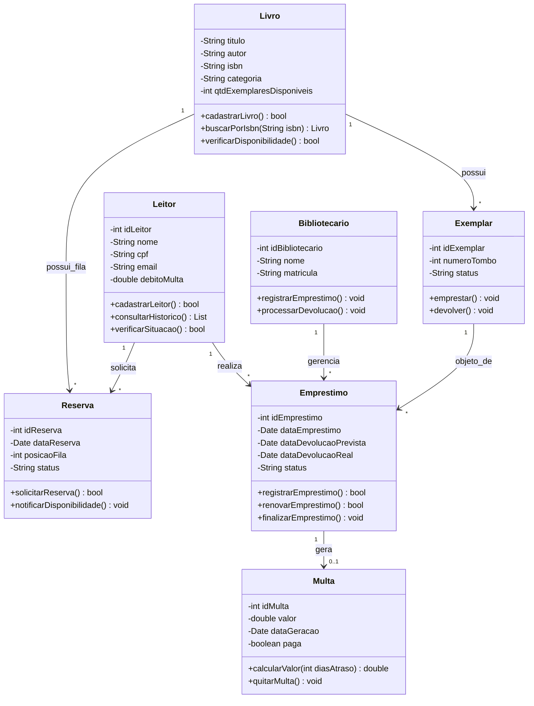
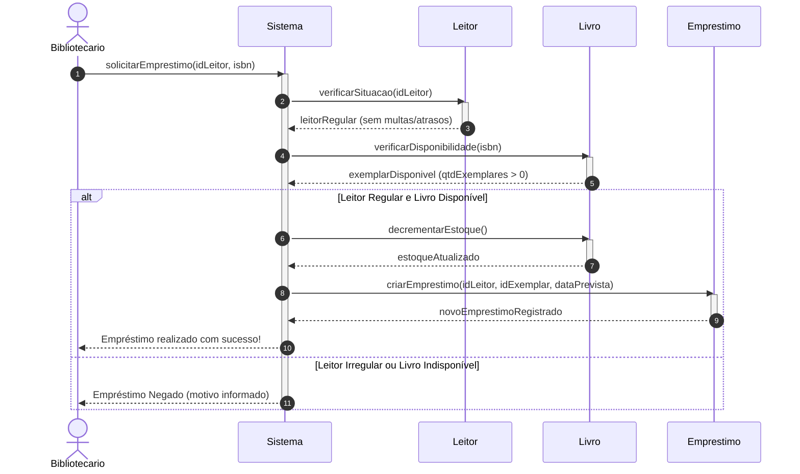
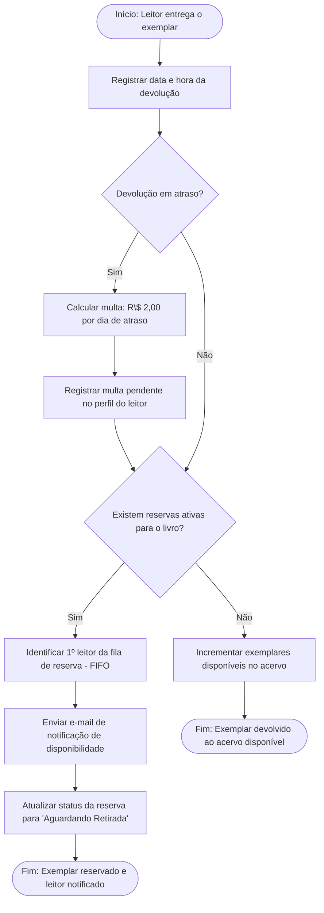

# Questão 2: Modelagem UML — Sistema BiblioTech

---

## a) Diagrama de Classes

O Diagrama de Classes abaixo representa a estrutura estática do sistema BiblioTech, mapeando as entidades de domínio, seus atributos, métodos e os relacionamentos com multiplicidade.

---

## b) Diagrama de Sequência: Cenário "Realizar Empréstimo de um Livro"

O Diagrama de Sequência abaixo ilustra o aspecto dinâmico da aplicação durante a execução do caso de uso de registro de empréstimo, demonstrando a verificação da situação do leitor, a checagem do acervo e a criação do registro de empréstimo.

---

## c) Diagrama de Atividades: Cenário "Devolver Livro e Processar Reservas"

O Diagrama de Atividades abaixo especifica o fluxo de controle para o processo de devolução de um livro, englobando a apuração de multas por atraso, a checagem da fila de reservas e a notificação do próximo leitor.

